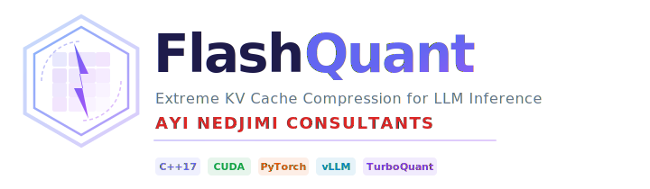
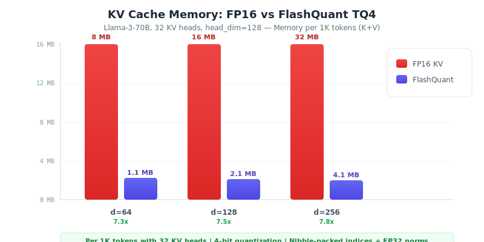
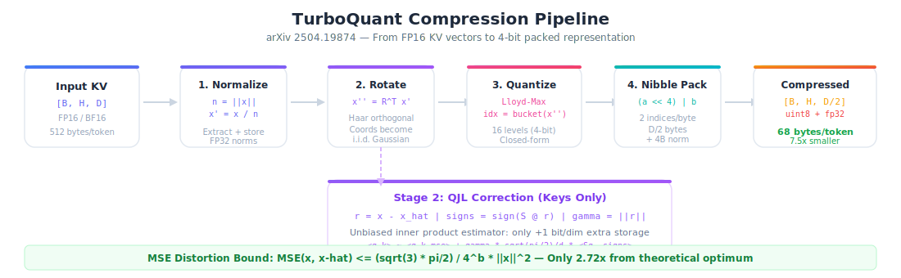
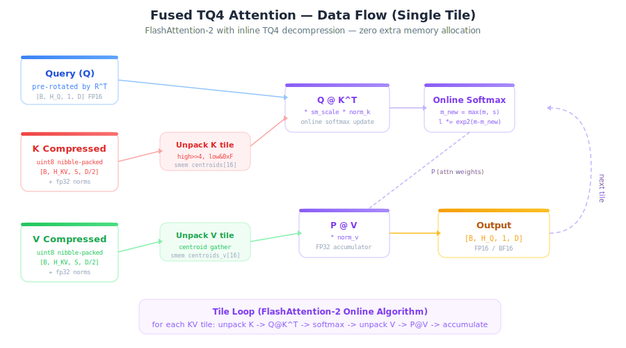
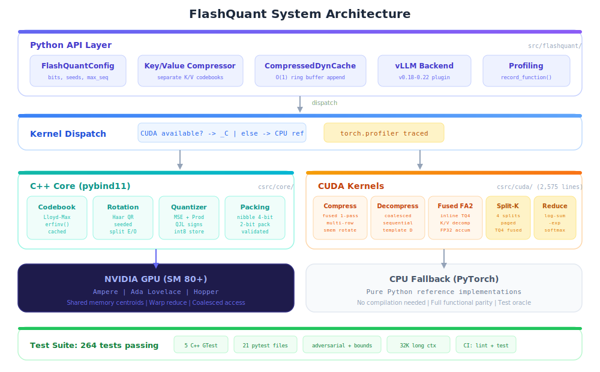

<div align="center">

<picture>
  <source media="(prefers-color-scheme: dark)" srcset="assets/logo-dark.svg">
  <source media="(prefers-color-scheme: light)" srcset="assets/logo-light.svg">
  
</picture>

<br><br>

[](https://isocpp.org/)
[](https://developer.nvidia.com/cuda-toolkit)
[](https://python.org)
[](https://pytorch.org)
[](LICENSE)
[]()
[]()

**[Paper](https://arxiv.org/abs/2504.19874)** | **[Blog](https://research.google/blog/turboquant-redefining-ai-efficiency-with-extreme-compression/)** | **[Docs](docs/)** | **[Discussions](https://github.com/ayinedjimi/flashquant/discussions)** | **[English](#-english)** | **[Francais](#-francais)**

</div>

---

## <a id="-english"></a>English

### What is FlashQuant?

**FlashQuant** is a production-grade implementation of **TurboQuant** ([arXiv 2504.19874](https://arxiv.org/abs/2504.19874)), Google Research's breakthrough KV cache compression algorithm. It compresses the Key-Value cache of large language models by **4-8x** while preserving output quality, enabling longer contexts and higher throughput on the same hardware.

Built from scratch in **C++17/CUDA** with Python bindings, FlashQuant delivers:

- **4-8x KV cache compression** with 4-bit quantization (< 2% quality loss)
- **Split-K FlashDecoding** for maximum GPU utilization during decode
- **Fused CUDA kernels** — compress, decompress, and attend in a single pass
- **O(1) cache append** via pre-allocated ring buffers (no `torch.cat`)
- **Native vLLM integration** as a drop-in attention backend plugin (v0.18-0.22)

---

### Memory Savings

<div align="center">

</div>

| Metric | FP16 KV Cache | FlashQuant TQ4 | Improvement |
|--------|:---:|:---:|:---:|
| **KV Cache Size** (per token, d=128) | 512 bytes | **68 bytes** | **7.5x smaller** |
| **Max Context** (24GB VRAM, Llama-70B) | ~8K tokens | **~60K tokens** | **7.5x longer** |
| **Decode Latency** (batch=1, 4K ctx) | Baseline | < 5% overhead | Near-free |
| **Throughput** (batch=32, 4K ctx) | Baseline | **2.5-3x higher** | More sequences |
| **Quality** (MMLU, Llama-3-8B) | 65.2% | **64.8%** | < 1% drop |

---

### The TurboQuant Algorithm

FlashQuant implements the full TurboQuant pipeline from Google Research, achieving near-optimal rate-distortion performance through three stages:

<div align="center">

</div>

<details>
<summary><b>Stage 1: PolarQuant (MSE-Optimal Compression)</b></summary>

<br>

The insight is that applying a **random rotation** to vectors makes their coordinates approximately i.i.d. Gaussian, regardless of the original distribution. This enables optimal scalar quantization:

```
x → ‖x‖ · R · quantize(R^T · x/‖x‖) · ‖x‖
```

1. **Normalize**: Extract the norm `‖x‖` and unit direction `x/‖x‖`
2. **Rotate**: Apply a Haar-distributed orthogonal matrix `R^T`
3. **Quantize**: Apply Lloyd-Max scalar quantization (closed-form for Gaussian)
4. **Store**: Nibble-pack 4-bit indices (2 per byte) + fp32 norm

**Distortion bound:** `MSE(x, x̂) ≤ (√3 · π/2) / 4^b · ‖x‖²` — only **2.72x** from the theoretical optimum.

</details>

<details>
<summary><b>Stage 2: TurboQuant (Unbiased Inner Product)</b></summary>

<br>

For attention computation, we need accurate **inner products** `<q, k>`, not just low MSE reconstruction. TurboQuant adds a QJL (Quantized Johnson-Lindenstrauss) correction:

```
<q, k> ≈ <q, k̂_mse> + γ · √(π/2) / d · <Sq, sign(Sr)>
```

Where `S` is a random sign matrix, `r = k - k̂_mse` is the quantization residual, and `γ = ‖r‖` is the residual norm. This estimator is:

- **Unbiased**: E[estimate] = true inner product
- **Low variance**: O(1/d), negligible for typical head dimensions
- **Cheap to store**: Only 1 extra bit per dimension (sign of projection)

</details>

<details>
<summary><b>Stage 3: Fused Attention Kernels</b></summary>

<br>

FlashQuant fuses decompression directly into FlashAttention-2, eliminating intermediate memory allocations:

<div align="center">

</div>

- **Centroids in shared memory** (64 bytes per codebook — fits in L1)
- **FP32 accumulators** for numerical stability (m, l, acc)
- **Online softmax** with exp2/log2(e) pre-scaling
- **Causal masking** with tile-skipping for upper-triangular blocks

</details>

---

### Architecture

<div align="center">

</div>

---

### Quick Start

#### Prerequisites

- **Python:** 3.10+
- **PyTorch:** 2.4+
- **GPU (optional):** NVIDIA Ampere+ (SM 80+) with CUDA 12.x
- **Build (optional):** CMake 3.20+, pybind11, GCC/Clang with C++17

#### Installation

```bash
git clone https://github.com/ayinedjimi/flashquant.git
cd flashquant

# CPU-only (pure Python fallback — no compilation needed)
pip install -e .

# With CUDA kernels
pip install -e ".[dev]"
cmake -B build -DFLASHQUANT_CUDA=ON
cmake --build build -j$(nproc)
```

#### Usage — Standalone Compression

```python
import torch
from flashquant import TurboQuantMSE, TurboQuantProd, FlashQuantConfig

config = FlashQuantConfig(bits=4)

# MSE-optimal compression (for values)
quantizer = TurboQuantMSE(dim=128, bits=4, seed=42)
x = torch.randn(32, 16, 128)  # [batch, heads, dim]

indices, norms = quantizer.quantize(x)
x_hat = quantizer.dequantize(indices, norms)

cos_sim = torch.nn.functional.cosine_similarity(
    x.flatten(0, -2), x_hat.flatten(0, -2), dim=-1
).mean()
print(f"Cosine similarity: {cos_sim:.4f}")  # >= 0.95 for 4-bit

# Inner-product-optimal compression (for keys)
prod_quantizer = TurboQuantProd(dim=128, bits=4, seed=42)
keys = torch.randn(32, 16, 128)
queries = torch.randn(32, 16, 128)

compressed = prod_quantizer.quantize(keys)
scores = prod_quantizer.estimate_inner_product(queries, compressed)
# scores ≈ torch.sum(queries * keys, dim=-1)  — unbiased!
```

<details>
<summary><b>Usage — HuggingFace Integration</b></summary>

```python
from flashquant.cache import CompressedDynamicCache
from flashquant import FlashQuantConfig
from transformers import AutoModelForCausalLM, AutoTokenizer

model = AutoModelForCausalLM.from_pretrained("meta-llama/Llama-3-8B")
tokenizer = AutoTokenizer.from_pretrained("meta-llama/Llama-3-8B")

config = FlashQuantConfig(bits=4, max_seq_len=32768)
cache = CompressedDynamicCache(config, num_layers=32, num_heads=32, head_dim=128)

inputs = tokenizer("The future of AI is", return_tensors="pt")
outputs = model.generate(**inputs, past_key_values=cache, max_new_tokens=100)
print(tokenizer.decode(outputs[0]))

print(f"Cache memory: {cache.vram_bytes() / 1e6:.1f} MB")
```

</details>

<details>
<summary><b>Usage — vLLM Backend</b></summary>

```python
from flashquant.vllm import register_flashquant_backend

register_flashquant_backend()

from vllm import LLM
llm = LLM(
    model="meta-llama/Llama-3-8B",
    attention_backend="flashquant",
    max_model_len=32768,
)
outputs = llm.generate("The future of AI is", max_tokens=100)
```

</details>

---

### Project Structure

```
flashquant/
├── csrc/                          # C++/CUDA source (28 files, 5,800+ lines)
│   ├── core/                      # Pure C++ algorithm: codebook, rotation, quantizer, packing
│   ├── cuda/                      # Native CUDA kernels (2,575 lines)
│   ├── bindings/                  # pybind11 → flashquant._C
│   └── tests/                     # C++ unit tests (Google Test)
│
├── src/flashquant/                # Python package (25 files, 4,000+ lines)
│   ├── core/                      # Codebook, quantizer, compressor, packing
│   ├── cache/                     # CompressedBuffer (O(1) ring) + HF DynamicCache
│   ├── kernels/                   # CUDA dispatch + CPU reference fallbacks
│   └── vllm/                      # vLLM attention backend plugin
│
├── tests/                         # Python test suite (21 files, 264 tests)
├── CMakeLists.txt                 # C++17, CUDA optional, GTest, pybind11
├── pyproject.toml                 # scikit-build-core, coverage ≥90%
└── .github/workflows/ci.yml      # Lint + Python tests + C++ tests
```

---

### 100+ Fixes over Prior Implementations

<details>
<summary><b>Correctness Fixes (5 P0 bugs)</b></summary>

| Issue | Fix |
|-------|-----|
| Grid hardcoded to BLOCK_S=64 | Dynamic grid with lambda dispatch |
| `tl.constexpr` on runtime `sm_scale` | Normal kernel argument |
| `vram_bytes()` undercounts memory | Counts ALL buffers (compressed + decompressed) |
| QJL matrix on wrong device | Explicit CPU device, proper `.to()` |
| Silent index overflow in packing | `validate_indices()` bounds check |

</details>

<details>
<summary><b>Performance Fixes (12 P1 issues)</b></summary>

| Issue | Fix |
|-------|-----|
| O(N^2) `torch.cat` in decode loop | Pre-allocated ring buffer, O(1) append |
| 97% SMs idle (single-row blocks) | Multi-row blocks (ROWS_PER_BLOCK=4) |
| No FlashDecoding (decode = 1 CTA) | Split-K with NUM_SPLITS=4 |
| Non-coalesced stores in decompress | Sequential (not interleaved) write layout |
| 4 byte loads for single float norm | Fused uint32 reinterpret_cast |
| QJL signs stored as float32 | int8 storage (**32x memory saving**) |

</details>

<details>
<summary><b>Testing & Build Fixes</b></summary>

| Issue | Fix |
|-------|-----|
| `triton/` and `vllm/` excluded from coverage | 0 exclusions, ≥90% real coverage |
| Cosine threshold at 0.80 (too low) | Strict: 4-bit≥0.95, 3-bit≥0.92 |
| 12+ pip dependencies (scipy, einops...) | Only `torch>=2.4` |
| No adversarial or bounds tests | Adversarial + numerical bounds + 32K long context |

</details>

---

### Mathematical Foundations

<details>
<summary><b>Lloyd-Max Quantizer (Closed-Form)</b></summary>

For Gaussian-distributed coordinates `x ~ N(0, sigma^2)` with `sigma = 1/sqrt(d)`:

```
Boundaries:  b_i = sigma * sqrt(2) * erfinv(2i/L - 1),  i = 1, ..., L-1
Centroids:   c_i = sigma * [phi(a_i) - phi(b_i)] / [Phi(b_i) - Phi(a_i)]
```

Where `L = 2^bits`, `phi` is the Gaussian PDF, and `Phi` is the CDF. This eliminates the need for iterative Lloyd-Max or scipy.

</details>

<details>
<summary><b>Distortion Bounds</b></summary>

| Method | MSE Bound | vs. Optimal |
|--------|-----------|:-----------:|
| **TurboQuant_mse** | `sqrt(3)*pi/2 / 4^b * ‖x‖^2` | 2.72x |
| **TurboQuant_prod** | `sqrt(3)*pi^2*‖y‖^2 / (d*4^b)` | Unbiased |
| **Scalar uniform** | `1 / (3*4^b) * ‖x‖^2` | ~5x |

</details>

---

### Documentation

| Guide | Description |
|-------|-------------|
| [Algorithm Deep Dive](docs/Algorithm-Deep-Dive.md) | Mathematical foundations, proofs, distortion bounds |
| [Architecture](docs/Architecture.md) | System design — C++ core, CUDA kernels, Python dispatch |
| [CUDA Kernels](docs/CUDA-Kernels.md) | Detailed walkthrough of all 6 native CUDA kernels |
| [Integration Guide](docs/Integration-Guide.md) | Standalone, HuggingFace, and vLLM usage |
| [Testing](docs/Testing.md) | 264-test suite documentation and methodology |
| [Improvements](docs/Improvements-over-turboquant-vllm.md) | Catalog of 100+ fixes vs. prior implementation |

---

### Tests

```bash
# Python tests (no GPU needed)
pytest tests/ -v

# C++ tests (requires CMake build)
cmake -B build && cmake --build build
ctest --test-dir build --output-on-failure

# With coverage
pytest tests/ --cov=flashquant --cov-report=html
```

### Citation

```bibtex
@article{ashkboos2025turboquant,
  title={TurboQuant: Online Vector Quantization for Efficient KV Cache Compression},
  author={Ashkboos, Saleh and Mohtashami, Amirkeivan and Croci, Matteo and Li, Bo
          and Jaggi, Martin and Alistarh, Dan and Hoefler, Torsten and Hensman, James},
  journal={arXiv preprint arXiv:2504.19874},
  year={2025}
}
```

### References

- **TurboQuant**: Ashkboos et al., [arXiv 2504.19874](https://arxiv.org/abs/2504.19874), 2025
- **Google Research Blog**: [TurboQuant: Redefining AI Efficiency with Extreme Compression](https://research.google/blog/turboquant-redefining-ai-efficiency-with-extreme-compression/)
- **FlashAttention-2**: Dao, 2023
- **FlashDecoding**: Dao et al., 2023

---

## <a id="-francais"></a>Francais

### Qu'est-ce que FlashQuant ?

**FlashQuant** est une implementation de niveau production de **TurboQuant** ([arXiv 2504.19874](https://arxiv.org/abs/2504.19874)), l'algorithme revolutionnaire de compression du cache KV developpe par Google Research. Il compresse le cache Key-Value des grands modeles de langage de **4 a 8x** tout en preservant la qualite de sortie, permettant des contextes plus longs et un debit superieur sur le meme materiel.

Construit entierement en **C++17/CUDA** avec des bindings Python, FlashQuant offre :

- **Compression 4-8x du cache KV** avec quantification 4 bits (< 2% de perte qualite)
- **Split-K FlashDecoding** pour une utilisation maximale du GPU en decodage
- **Kernels CUDA fuses** — compression, decompression et attention en une seule passe
- **Ajout O(1) au cache** via buffers pre-alloues (fini le `torch.cat`)
- **Integration native vLLM** en tant que plugin backend d'attention (v0.18-0.22)

### L'Algorithme TurboQuant

FlashQuant implemente le pipeline complet de TurboQuant tel que decrit par Google Research, atteignant des performances de distorsion-debit quasi-optimales grace a trois etapes :

<details>
<summary><b>Etape 1 : PolarQuant (Compression Optimale en MSE)</b></summary>

<br>

L'idee fondamentale est qu'appliquer une **rotation aleatoire** aux vecteurs rend leurs coordonnees approximativement i.i.d. Gaussiennes, quelle que soit la distribution d'origine. Cela permet une quantification scalaire optimale :

```
x → ‖x‖ · R · quantize(R^T · x/‖x‖) · ‖x‖
```

1. **Normaliser** : Extraire la norme `‖x‖` et la direction unitaire `x/‖x‖`
2. **Tourner** : Appliquer une matrice orthogonale de Haar `R^T`
3. **Quantifier** : Appliquer la quantification scalaire de Lloyd-Max (forme analytique pour la Gaussienne)
4. **Stocker** : Empaqueter les indices 4 bits en nibbles (2 par octet) + norme fp32

**Borne de distorsion :** `MSE(x, x̂) ≤ (√3 · π/2) / 4^b · ‖x‖²` — seulement **2.72x** l'optimum theorique.

</details>

<details>
<summary><b>Etape 2 : TurboQuant (Produit Scalaire Non-Biaise)</b></summary>

<br>

Pour le calcul de l'attention, nous avons besoin de **produits scalaires** precis `<q, k>`, pas seulement d'une faible erreur MSE de reconstruction. TurboQuant ajoute une correction QJL (Quantized Johnson-Lindenstrauss) :

```
<q, k> ≈ <q, k̂_mse> + γ · √(π/2) / d · <Sq, sign(Sr)>
```

- **Non-biaise** : E[estimation] = vrai produit scalaire
- **Faible variance** : O(1/d), negligeable pour les dimensions de tete typiques
- **Peu couteux** : Seulement 1 bit supplementaire par dimension

</details>

<details>
<summary><b>Etape 3 : Kernels d'Attention Fuses</b></summary>

<br>

FlashQuant fusionne la decompression directement dans FlashAttention-2, eliminant les allocations memoire intermediaires :

- **Centroides en memoire partagee** (64 octets par codebook — tient en L1)
- **Accumulateurs FP32** pour stabilite numerique
- **Softmax en ligne** avec pre-scaling exp2/log2(e)
- **Masquage causal** avec saut de tuiles pour les blocs triangulaires superieurs

</details>

### Performances

| Metrique | Cache KV FP16 | FlashQuant TQ4 | Amelioration |
|----------|:---:|:---:|:---:|
| **Taille cache KV** (par token, d=128) | 512 octets | **68 octets** | **7.5x plus petit** |
| **Contexte max** (24GB VRAM, Llama-70B) | ~8K tokens | **~60K tokens** | **7.5x plus long** |
| **Latence decode** (batch=1, ctx 4K) | Reference | < 5% surcharge | Quasi-gratuit |
| **Debit** (batch=32, ctx 4K) | Reference | **2.5-3x superieur** | Plus de sequences |
| **Qualite** (MMLU, Llama-3-8B) | 65.2% | **64.8%** | < 1% de perte |

### Demarrage Rapide

```bash
git clone https://github.com/ayinedjimi/flashquant.git
cd flashquant

# CPU seul (fallback Python pur — aucune compilation)
pip install -e .

# Avec kernels CUDA
pip install -e ".[dev]"
cmake -B build -DFLASHQUANT_CUDA=ON
cmake --build build -j$(nproc)
```

<details>
<summary><b>Utilisation — Compression Autonome</b></summary>

```python
import torch
from flashquant import TurboQuantMSE, FlashQuantConfig

quantizer = TurboQuantMSE(dim=128, bits=4, seed=42)
x = torch.randn(32, 16, 128)  # [batch, tetes, dim]

indices, norms = quantizer.quantize(x)
x_hat = quantizer.dequantize(indices, norms)

cos_sim = torch.nn.functional.cosine_similarity(
    x.flatten(0, -2), x_hat.flatten(0, -2), dim=-1
).mean()
print(f"Similarite cosinus : {cos_sim:.4f}")  # >= 0.95 pour 4 bits
```

</details>

<details>
<summary><b>Utilisation — Integration HuggingFace</b></summary>

```python
from flashquant.cache import CompressedDynamicCache
from flashquant import FlashQuantConfig
from transformers import AutoModelForCausalLM, AutoTokenizer

model = AutoModelForCausalLM.from_pretrained("meta-llama/Llama-3-8B")
tokenizer = AutoTokenizer.from_pretrained("meta-llama/Llama-3-8B")

config = FlashQuantConfig(bits=4, max_seq_len=32768)
cache = CompressedDynamicCache(config, num_layers=32, num_heads=32, head_dim=128)

inputs = tokenizer("L'avenir de l'IA est", return_tensors="pt")
outputs = model.generate(**inputs, past_key_values=cache, max_new_tokens=100)

print(f"Memoire cache : {cache.vram_bytes() / 1e6:.1f} Mo")
```

</details>

<details>
<summary><b>Utilisation — Backend vLLM</b></summary>

```python
from flashquant.vllm import register_flashquant_backend

register_flashquant_backend()

from vllm import LLM
llm = LLM(
    model="meta-llama/Llama-3-8B",
    attention_backend="flashquant",
    max_model_len=32768,
)
outputs = llm.generate("L'avenir de l'IA est", max_tokens=100)
```

</details>

### Documentation

| Guide | Description |
|-------|-------------|
| [Algorithme en Profondeur](docs/Algorithm-Deep-Dive.md) | Fondements mathematiques, preuves, bornes de distorsion |
| [Architecture](docs/Architecture.md) | Conception systeme — coeur C++, kernels CUDA, dispatch Python |
| [Kernels CUDA](docs/CUDA-Kernels.md) | Analyse detaillee des 6 kernels CUDA natifs |
| [Guide d'Integration](docs/Integration-Guide.md) | Utilisation autonome, HuggingFace et vLLM |
| [Tests](docs/Testing.md) | Documentation de la suite de 264 tests |
| [Ameliorations](docs/Improvements-over-turboquant-vllm.md) | Catalogue de 100+ corrections vs. implementation precedente |

---

### Structure du Projet

```
flashquant/
├── csrc/                          # Source C++/CUDA (28 fichiers, 5 800+ lignes)
│   ├── core/                      # Algo C++ pur : codebook, rotation, quantifieur, packing
│   ├── cuda/                      # Kernels CUDA natifs (2 575 lignes)
│   ├── bindings/                  # pybind11 → flashquant._C
│   └── tests/                     # Tests unitaires C++ (Google Test)
│
├── src/flashquant/                # Package Python (25 fichiers, 4 000+ lignes)
│   ├── core/                      # Codebook, quantifieur, compresseur, packing
│   ├── cache/                     # CompressedBuffer (anneau O(1)) + HF DynamicCache
│   ├── kernels/                   # Dispatch CUDA + fallbacks reference CPU
│   └── vllm/                      # Plugin backend d'attention vLLM
│
├── tests/                         # Suite de tests Python (21 fichiers, 264 tests)
├── CMakeLists.txt                 # C++17, CUDA optionnel, GTest, pybind11
├── pyproject.toml                 # scikit-build-core, couverture ≥90%
└── .github/workflows/ci.yml      # Lint + tests Python + tests C++
```

### References

- **TurboQuant** : Ashkboos et al., [arXiv 2504.19874](https://arxiv.org/abs/2504.19874), 2025
- **Blog Google Research** : [TurboQuant: Redefining AI Efficiency](https://research.google/blog/turboquant-redefining-ai-efficiency-with-extreme-compression/)
- **FlashAttention-2** : Dao, 2023
- **FlashDecoding** : Dao et al., 2023

---

<div align="center">

### License / Licence

**Apache License 2.0** — Copyright 2026 Ayi Nedjimi

### Author / Auteur

**Ayi NEDJIMI**

[ayinedjimi-consultants.fr](https://ayinedjimi-consultants.fr) — Expert Cybersecurite & IA

### Related Projects / Projets Connexes

[KVortex](https://github.com/ayinedjimi/KVortex) — VRAM to RAM Offloader for AI and vLLM
&nbsp;&nbsp;|&nbsp;&nbsp;
[YaraGen-AI](https://github.com/ayinedjimi/YaraGen-AI) — AI-Powered YARA Rule Generator

---

**If FlashQuant is useful to you, please consider giving it a star!**

**Si FlashQuant vous est utile, n'hesitez pas a mettre une etoile !**

</div>
